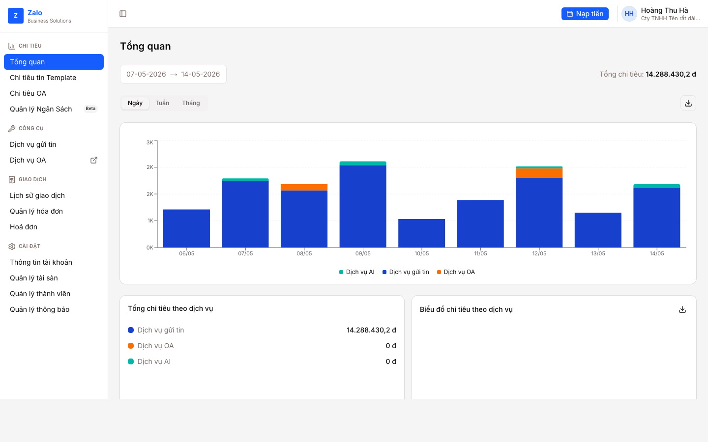
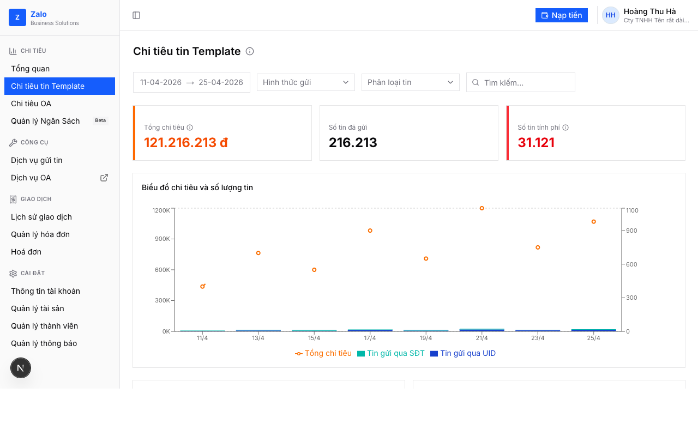
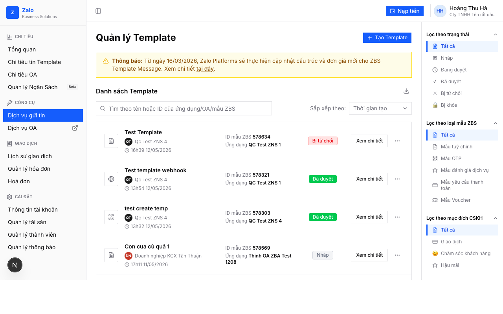
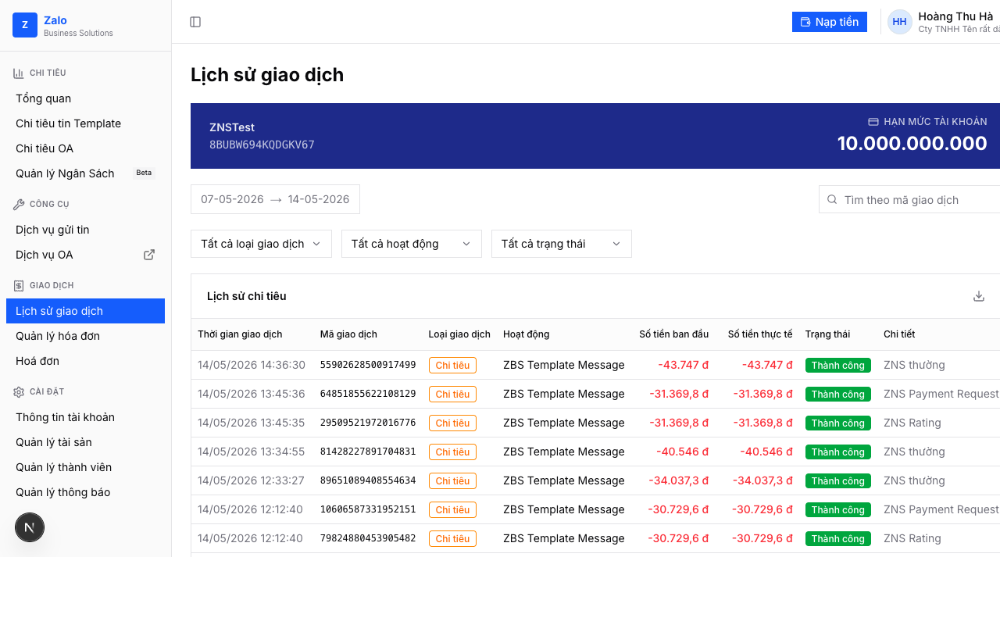

# 🎨 ZBS Account UI — Prototype

> Prototype giao diện quản lý tài khoản Zalo Business Solutions.  
> Dành cho PM/Designer — không cần biết code.

---

## 🚀 Bắt đầu

### 📦 Bước 1 — Cài đặt (chỉ làm 1 lần)

| Công cụ | Tải về | Kiểm tra |
|---|---|---|
| **Node.js** | [nodejs.org](https://nodejs.org) → bản LTS | `node -v` → thấy số là được ✅ |
| **pnpm** | Mở Terminal, chạy: `npm i -g pnpm` | `pnpm -v` → thấy số là được ✅ |
| **Claude Code** | [claude.ai/code](https://claude.ai/code) | `claude -v` → thấy số là được ✅ |

> 🔑 **Chưa có SSH key GitHub?** Chạy lệnh này trong Terminal, sau đó làm theo hướng dẫn:
> ```bash
> ssh-keygen -t ed25519 -C "email@cua-ban.com"
> ```
> Copy nội dung file `~/.ssh/id_ed25519.pub` và thêm vào [GitHub → Settings → SSH Keys](https://github.com/settings/keys).

---

### ⚡ Bước 2 — Mở Claude Code với repo này

Mở **Terminal**, copy và chạy lệnh sau:

```bash
git clone git@github.com:ZBS-Product/zbs-account-prototype.git zbs-prototype && cd zbs-prototype && pnpm install && claude
```

Claude Code sẽ tự mở. Tiếp theo, paste prompt này vào Claude Code:

```
Chạy dev server, sau đó cho mình xem UI đang có gì
```

Mở trình duyệt vào **http://localhost:3000** — prototype hiện ra ngay. 🎉

---

### 🔁 Lần sau (đã clone rồi)

```bash
cd zbs-prototype && claude
```

Rồi paste vào Claude Code:

```
Chạy dev server
```

---

## 💬 Làm gì với Claude Code?

Gõ hoặc paste yêu cầu bằng tiếng Việt bình thường. Ví dụ:

**🖼️ Thêm trang mới — paste screenshot Figma kèm mô tả:**
```
Làm trang này theo design: [kéo thả ảnh Figma vào đây]
Trang đặt tại /giao-dich/hoa-don, thêm vào sidebar
```

**🎨 Chỉnh UI:**
```
Card "Tổng chi tiêu" font số tiền quá nhỏ, tăng lên và thêm viền cam bên trái
```

**📊 Thêm dữ liệu:**
```
Thêm 10 dòng vào bảng Lịch sử giao dịch, mix đủ 3 trạng thái
```

**🌿 Làm trên branch riêng** (khuyến nghị trước mỗi thử nghiệm mới):
```
Tạo branch prototype/ten-tinh-nang rồi thêm trang ...
```

---

## 📸 Screenshots

### Tổng quan


### Chi tiêu tin Template


### Dịch vụ gửi tin


### Lịch sử giao dịch


---

## 🗂️ Trang đã có

| Route | Tên trang |
|---|---|
| `/` | 📊 Tổng quan |
| `/chi-tieu/tin-template` | 📨 Chi tiêu tin Template |
| `/cong-cu/gui-tin` | 📤 Dịch vụ gửi tin |
| `/giao-dich/lich-su` | 🧾 Lịch sử giao dịch |

---

<details>
<summary>🛠️ Tech stack</summary>

| | |
|---|---|
| Framework | Next.js 16 (App Router, Turbopack) |
| UI | shadcn/ui + Tailwind CSS v4 |
| Charts | Recharts 3 |
| Language | TypeScript |
| Package Manager | pnpm |

</details>
